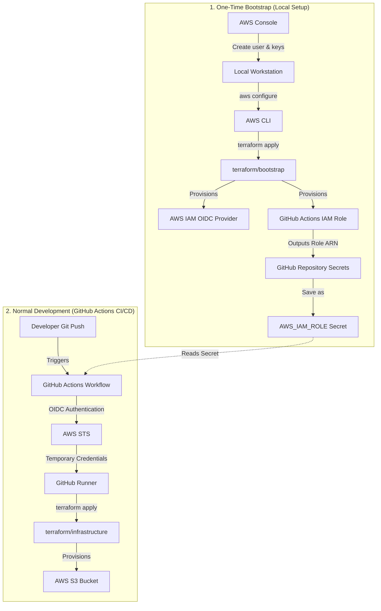

# IntegrationNinjas AWS + Terraform Series

Companion repository for the IntegrationNinjas YouTube series on AWS deployments with Terraform and GitHub Actions.

## Episode 1: Secure AWS Authentication with GitHub OIDC + Terraform | Deploy Your First S3 Bucket

### Architecture Overview



---

### Repository Structure

```text
aws-terraform-lab/
├── .github/
│   └── workflows/
│       └── infra.yml
├── terraform/
│   ├── bootstrap/
│   │   ├── versions.tf
│   │   ├── provider.tf
│   │   ├── variables.tf
│   │   ├── oidc.tf
│   │   ├── iam.tf
│   │   └── outputs.tf
│   └── infrastructure/
│       ├── versions.tf
│       ├── provider.tf
│       ├── variables.tf
│       ├── s3.tf
│       └── outputs.tf
├── README.md
└── .gitignore
```

---

### Key Learning Objectives

* **Why GitHub OIDC**: Eliminate risk of long-lived AWS static access keys in GitHub Secrets by exchanging GitHub OIDC tokens for short-lived AWS IAM credentials.
* **One-Time Bootstrap Isolation**: Separate initial identity/role bootstrapping from standard infrastructure deployments.
* **Terraform Best Practices**: Pin version constraints, organize modules cleanly, commit `.terraform.lock.hcl`, and avoid leaking sensitive outputs in automation pipelines.

---

### Quick Start Guide

#### Step 1: Run One-Time Bootstrap (Locally)
1. Configure AWS CLI with temporary administrative credentials (`aws configure`).
2. Change directory to `terraform/bootstrap`.
3. Run:
   ```bash
   terraform init
   terraform apply
   ```
4. Note the output `terraform_role_arn`.

#### Step 2: Set GitHub Repository Secret
1. Go to your GitHub Repository **Settings > Secrets and variables > Actions**.
2. Create a repository secret named `AWS_IAM_ROLE` with the value of `terraform_role_arn`.

#### Step 3: Trigger Infrastructure Pipeline
1. Push changes to the `ep1-oidc-s3` branch.
2. GitHub Actions will authenticate using OIDC and apply the `terraform/infrastructure` stack to provision your S3 bucket.
