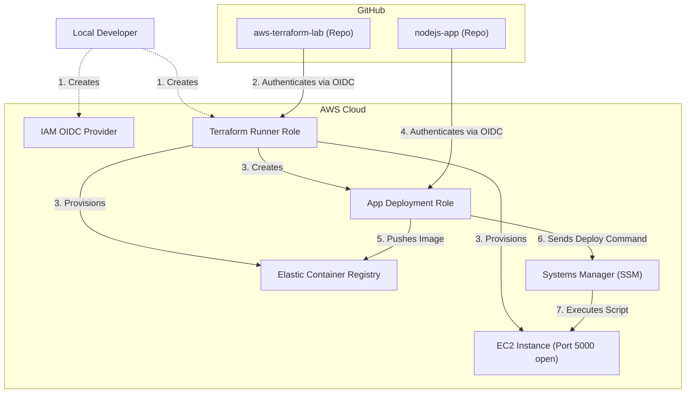

# AWS Terraform Lab: Secure OIDC 2-Stage Deployment Architecture

Companion repository for the IntegrationNinjas YouTube series on AWS deployments with Terraform and GitHub Actions. Covers secure OIDC authentication (no static AWS access keys), EC2 provisioning, ECR image builds, and SSM-based remote deployment.

## The Problem: The "Chicken and Egg" OIDC Issue
When attempting to use GitHub Actions OIDC to run Terraform, you need an OIDC provider and an IAM Role in AWS *before* GitHub Actions can run Terraform. But you want to create that OIDC provider and Role *using* Terraform. 

**The Solution:** A 2-stage architecture where a small local `bootstrap` creates the initial authentication, and the automated `infrastructure` pipeline handles everything else.

---

## Architecture



## How It Works

### Stage 1: The Bootstrap (Local & One-Time)
Located in `terraform/bootstrap`. You run this locally from your machine one time using your AWS credentials.
- Creates the **GitHub OIDC Provider** in AWS.
- Creates the **Terraform Runner IAM Role** with Admin permissions.
- Scopes the trust policy exclusively to the immutable OIDC subject claim of the `aws-terraform-lab` repository.

### Stage 2: Infrastructure Provisioning (Automated via GitHub Actions)
Located in `terraform/infrastructure`. Run automatically by GitHub Actions when you push to the `ec2-terraform` branch.
- Authenticates securely to AWS using the Role created in the bootstrap stage (No hardcoded credentials!).
- Creates the **VPC Security Groups** (Port 5000 open, Port 22 closed).
- Creates the **ECR Repository** for Docker images.
- Creates the **EC2 Instance** (with an IAM Instance Profile granting SSM access).
- Creates a dedicated **App Deployment IAM Role** strictly scoped to the `nodejs-app` repository for future deployments.

---

## Setup Instructions

### 1. Run the Bootstrap
```bash
cd terraform/bootstrap
cp terraform.tfvars.example terraform.tfvars
# Edit terraform.tfvars to match your GitHub Org and Repository OIDC Claims

terraform init
terraform apply
```
*Copy the `terraform_role_arn` from the output!*

### 2. Configure GitHub Secrets
Go to your `aws-terraform-lab` repository settings on GitHub:
- Navigate to **Settings > Secrets and variables > Actions**
- Add a new repository secret:
  - **Name**: `AWS_IAM_ROLE`
  - **Secret**: The ARN you copied from the bootstrap step.

### 3. Deploy the Infrastructure
Commit your changes and push to the `ec2-terraform` branch. GitHub Actions will take over, authenticate via OIDC, and provision the remaining AWS infrastructure!

```bash
git add .
git commit -m "deploy infrastructure"
git push origin ec2-terraform
```
